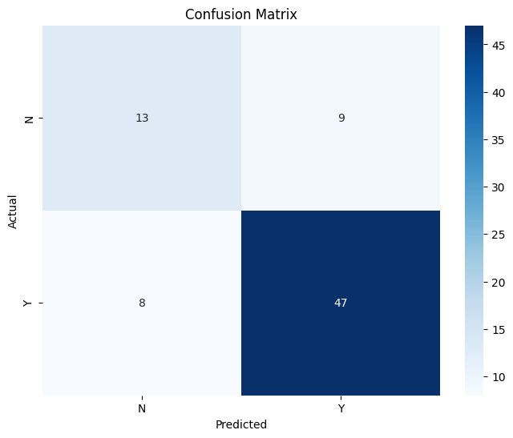
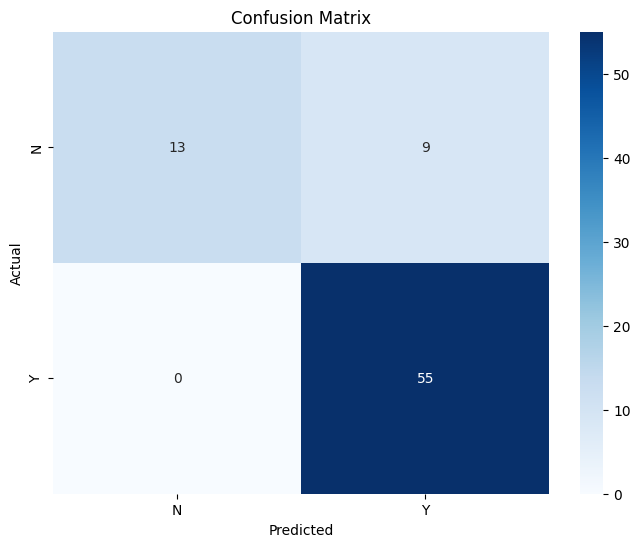

# loan_prediction
Treinamento de modelos em python para previsão de aprovação de empréstimos com base em dados de clientes.

## Objetivo

Criar um pipeline de machine learning que:

- Trata dados faltantes
- Transforma dados para melhor aproveitamento dos modelos treinados
- Balanceia as classes com SMOTE
- Treina e avalia modelos Decision Tree, Random Forest e XGBoost
- Ajusta o treshold para aumentar precisão dos modelos Random Forest e XGBoost

## Dataset

O dataset foi obtido via kaggle:

> [Loan Status Prediction](https://www.kaggle.com/datasets/bhavikjikadara/loan-status-prediction/data)

*Dataset não incluido no repositório por questão de licença. Pode-se baixá-lo a partir do link acima*

## Como executar

1. Clone este repositório:
```bash
git clone https://github.com/miguelgomesf/loan_prediction.git
```
2. Instale as dependências
```bash
pip install -r requirements.txt
```
3. Execute o notebook
- Acesse o arquivo loan_prediction.ipynb via [Google Colab](https://colab.research.google.com/drive/1awOHU-io4M6RRyZvQBjzfINfpn7p7e7Y?usp=sharing)
- Ou localmente via Jupyter Notebook

## Tecnologias e bibliotecas
- Python 3
- Pandas, NumPy
- Scikit-learn
- XGBoost
- Imbalanced-learn (SMOTE)
- Matplotlib, Seaborn

## Raciocínio por trás do projeto

1. **Entendimento do problema:** O objetivo era prever aprovações de empréstimo com base em informações financeiras e demográficas
2. **Análise Inicial:** Algumas colunas tinham valores faltantes e/ou eram variáveis categóricas, informações importantes para o tratamento dos dados
3. **Desbalanceamento:** Observei que no dataset, a classe 1 (Empréstimo aprovado) era muito mais frequente, o que poderia fazer os modelos serem desbalanceados também
4. **Pré-processamento:** Por serem poucos os valores nulos, tratei a maioria deles com a moda (que também costumavam ser muito mais presentes que os outros valores), exceto por Credit_History, que tratei colocando o valor -1.0 (Missing), também inclui novas colunas que poderiam ser interessantes como TotalIncome (ApplicantIncome + CoapplicantIncome) e IncomePerFamily (TotalIncome/Dependents + 1). Além disso, transformei a variável Dependents em numérica e apliquei One-hot encoding nas variáveis categóricas
5. **Balanceamento:** Antes de treinar e testar os modelos, tentei balancear melhor as classes utilizando SMOTE
6. **Modelos:** Escolhi Decision Tree, Random Forest e XGBoost e os comparei, com Random Forest e XGBoost consegui também ajustar o treshold.
7. **Avaliação:** Para avaliá-los, fiz uma matriz de confusão e um relatório de classificação que avaliava precisão, recall e f1-score, além da acurácia.

## Resultados

- O uso de SMOTE melhorou muito os modelos (havia feito sem o uso deles antes)
- O modelo de Decision Tree foi o mais ineficaz entre eles, talvez por não ser possível ajustar o treshold já que os valores eram muito binários
- O modelo de Random Forest se mostrou o mais equilibrado entre eles
- O modelo de XGBoost, a depender do treshold utilizado, pode ser mais equilibrado ou com um enfoque maior na classe 1, com um treshold de 0.2, ele prevê corretamente todos os exemplos da classe 1, mas em compensação, tem um índice maior de falsos positivos, ou seja, aprova mais empréstimos que deveriam ser negados. Já com um treshold de 0.6, ele traz mais equilíbrio, porém, o modelo de Random Forest ainda se mostra superior

**Matrizes de confusão**
- Decision Tree

- Random Forest (treshold 0.6)

- XGBoost (treshold 0.2)

- XGBoost (treshold 0.6)


## Aprendizados

- Diferentes contextos para tratamento dos dados
- Impacto do desbalanceamento de classes e como lidar com ele
- Avaliação de modelos além da acurácia
- Possibilidades com ajuste de treshold

## Licença

Este projeto é de uso educacional e está licenciado sobre a licença MIT


